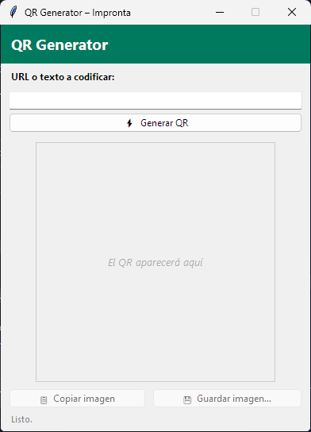
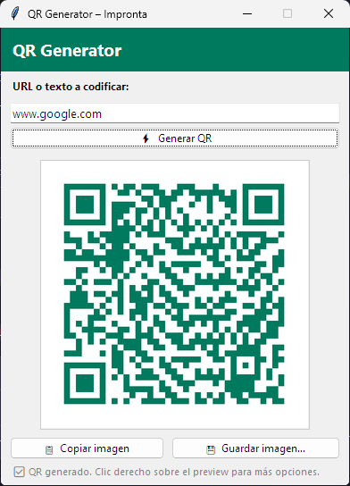

# QR Generator – Impronta

Aplicación de escritorio para Windows que genera códigos QR a partir de una URL o texto, con vista previa en vivo y opciones para copiar al portapapeles o guardar como imagen. Construida en Python con Tkinter y empaquetada como ejecutable portable con PyInstaller.

> **Contexto:** este es un proyecto laboral desarrollado para uso interno de **OTEC Impronta**, publicado aquí como parte de mi portafolio.

## Capturas

| Estado inicial                                     | QR generado                                 |
| -------------------------------------------------- | ------------------------------------------- |
|  |  |

## Características

- Generación de códigos QR a partir de cualquier URL o texto.
- Vista previa instantánea dentro de la misma ventana.
- Copiar la imagen directamente al portapapeles de Windows (clic derecho o botón dedicado).
- Guardar el QR como archivo PNG/JPG.
- Corrección de errores configurable para permitir superposición de logo (vía la función `generate_qr`, disponible para uso programático).
- Empaquetable como `.exe` portable — no requiere Python instalado en el equipo destino.

## Requisitos

- Python 3.9+
- Windows (la función de copiar al portapapeles usa `pywin32`; en otros sistemas operativos la app funciona igual salvo por esa función)

## Instalación

```bash
git clone https://github.com/GabrielBurgosS/OTECQR.git
cd OTECQR
python -m venv .venv
.venv\Scripts\activate
pip install -r requirements.txt
```

## Uso

```bash
python qr_generator.py
```

1. Escribe una URL o texto en el campo de entrada.
2. Presiona **Generar QR** (o Enter).
3. Copia la imagen al portapapeles o guárdala como PNG/JPG.

## Compilar como ejecutable portable

El proyecto incluye un `.spec` de PyInstaller listo para usar:

```bash
pyinstaller qr_generator.spec
```

El ejecutable resultante queda en `dist/QR_Generator_Impronta.exe`. Más detalles en [README_build.md](README_build.md).

## Estructura del proyecto

```
qr_generator.py        # Aplicación principal (UI + lógica de generación de QR)
qr_generator.spec       # Configuración de empaquetado con PyInstaller
QRGenerator.ipynb        # Notebook de prototipado inicial del generador de QR
requirements.txt        # Dependencias del proyecto
```

## Licencia

Este proyecto está bajo la licencia MIT. Ver [LICENSE](LICENSE) para más detalles.
